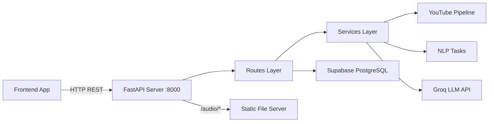
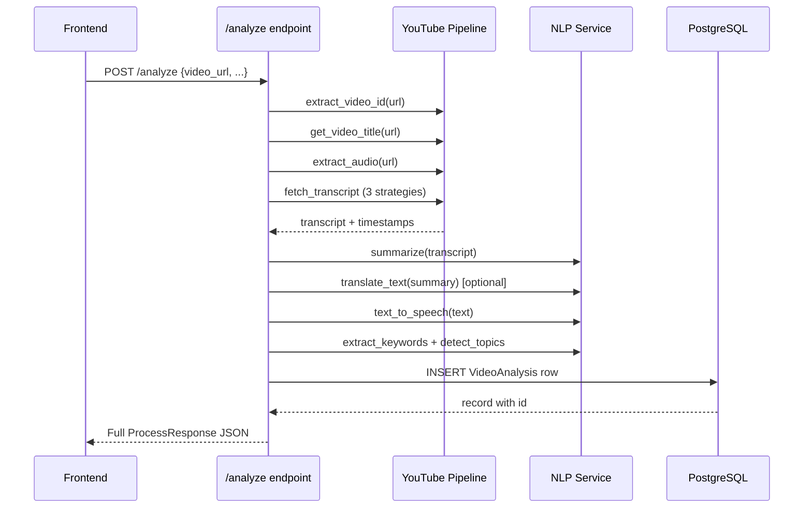

# YT-Sum Backend — Complete API Documentation

> **Version:** 2.0.0 &nbsp;|&nbsp; **Framework:** FastAPI + SQLModel &nbsp;|&nbsp; **Database:** Supabase PostgreSQL  
> **Base URL:** `http://localhost:8000` (development)

---

## Table of Contents

1. [Architecture Overview](#architecture-overview)
2. [Project Structure](#project-structure)
3. [Environment Setup](#environment-setup)
4. [Database Schema](#database-schema)
5. [API Endpoints](#api-endpoints)
   - [Health Check](#1-health-check)
   - [Analyze Video](#2-analyze-video)
   - [Get Video by ID](#3-get-video-by-id)
   - [List All Analyses](#4-list-all-analyses)
   - [Get History Item](#5-get-history-item)
   - [Ask a Question (Q&A)](#6-ask-a-question-qa)
   - [Get Settings](#7-get-settings)
   - [Update Settings](#8-update-settings)
6. [Static File Serving](#static-file-serving)
7. [Error Handling](#error-handling)
8. [CORS Setup for Frontend](#cors-setup-for-frontend)
9. [Frontend Integration Guide](#frontend-integration-guide)

---

## Architecture Overview



**Processing pipeline when a video is analyzed:**



### Transcript Extraction Strategy (automatic fallback)

| Priority | Method | Description |
|----------|--------|-------------|
| 1 | `youtube-transcript-api` | Official YouTube captions (fastest) |
| 2 | `yt-dlp` auto-subtitles | Downloads auto-generated VTT subs |
| 3 | Whisper ASR | Local speech-to-text on extracted audio (slowest) |

### Summarization Strategy

| Priority | Engine | Description |
|----------|--------|-------------|
| 1 | **Groq LLM** (if `USE_GROQ=true` and API key set) | Uses Llama 3.3 70B via cloud API |
| 2 | **Extractive** (sumy LSA) | Statistical sentence ranking |
| 3 | **Abstractive** (HuggingFace transformers) | Requires `enable_transformers=true` in settings |

---

## Project Structure

```
yt-sum/
├── .env                          # Environment variables (DATABASE_URL, GROQ keys)
├── .env.example                  # Template for .env
├── requirements.txt              # Python dependencies
├── app/
│   ├── __init__.py
│   ├── main.py                   # FastAPI app, lifespan, router registration
│   ├── config.py                 # Env loading, DATABASE_URL validation
│   ├── database.py               # SQLAlchemy engine, session dependency, init_db()
│   ├── models.py                 # SQLModel ORM model (VideoAnalysis)
│   ├── schemas.py                # Pydantic request/response schemas
│   ├── routes/
│   │   ├── __init__.py
│   │   ├── analysis.py           # All video analysis + Q&A endpoints
│   │   ├── settings.py           # Settings CRUD endpoints
│   │   └── video.py              # Re-export alias
│   └── services/
│       ├── __init__.py
│       ├── youtube_pipeline.py   # Video ID extraction, transcript fetching, audio extraction
│       ├── nlp_tasks.py          # Summarization, translation, TTS, keywords, Q&A
│       └── settings_store.py     # JSON file-based settings persistence
├── data/                         # Downloaded audio/subtitle cache
└── audio_outputs/                # Generated TTS audio files
```

---

## Environment Setup

### `.env` file (required)

```bash
# Supabase PostgreSQL (Session Pooler — port 6543)
DATABASE_URL=postgresql://postgres.<project-ref>:<url-encoded-password>@aws-0-<region>.pooler.supabase.com:6543/postgres

# Groq LLM (optional but recommended for best summaries)
GROQ_API_KEY=gsk_YOUR_KEY_HERE
GROQ_MODEL=llama-3.3-70b-versatile
USE_GROQ=true
```

### Start the server

```bash
source ~/venv/bin/activate
uvicorn app.main:app --reload
# Server starts at http://127.0.0.1:8000
```

### Auto-generated API docs

| URL | Description |
|-----|-------------|
| `http://localhost:8000/docs` | Swagger UI (interactive) |
| `http://localhost:8000/redoc` | ReDoc (read-only) |

---

## Database Schema

### Table: `videoanalysis`

This is the single database table. It stores every video analysis result.

| Column | Type | Constraints | Default | Description |
|--------|------|-------------|---------|-------------|
| `id` | `INTEGER` | **PRIMARY KEY**, auto-increment | auto | Unique row ID |
| `video_url` | `VARCHAR` | NOT NULL | — | Full YouTube URL |
| `video_id` | `VARCHAR` | NOT NULL, **INDEXED** | — | YouTube video ID (e.g. `dQw4w9WgXcQ`) |
| `video_title` | `VARCHAR` | NOT NULL | `"Unknown"` | Video title from YouTube |
| `transcript_text` | `TEXT` | NOT NULL | — | Cleaned transcript text |
| `summary_text` | `TEXT` | NOT NULL | — | Generated summary |
| `summary_type` | `VARCHAR` | NOT NULL | — | `"extractive"` or `"abstractive"` |
| `summary_length` | `INTEGER` | NOT NULL | — | Number of sentences requested |
| `translated_text` | `TEXT` | NULLABLE | `null` | Translated summary (if requested) |
| `translation_language` | `VARCHAR` | NULLABLE | `null` | ISO language code (e.g. `"ta"`, `"hi"`, `"fr"`) |
| `tts_audio_path` | `VARCHAR` | NULLABLE | `null` | Server-side path to TTS MP3 file |
| `duration_seconds` | `INTEGER` | NOT NULL | `0` | Video duration in seconds |
| `transcript_words` | `INTEGER` | NOT NULL | `0` | Word count of transcript |
| `summary_words` | `INTEGER` | NOT NULL | `0` | Word count of summary |
| `compression_ratio` | `FLOAT` | NOT NULL | `0.0` | Compression percentage (0–100) |
| `keywords` | `VARCHAR` | NOT NULL | `""` | Comma-separated keywords |
| `topics` | `VARCHAR` | NOT NULL | `""` | Comma-separated topic labels |
| `created_at` | `TIMESTAMP` | NOT NULL | `utcnow()` | When the analysis was created |

### SQL equivalent

```sql
CREATE TABLE IF NOT EXISTS videoanalysis (
    id          SERIAL PRIMARY KEY,
    video_url   VARCHAR NOT NULL,
    video_id    VARCHAR NOT NULL,
    video_title VARCHAR NOT NULL DEFAULT 'Unknown',
    transcript_text  TEXT NOT NULL,
    summary_text     TEXT NOT NULL,
    summary_type     VARCHAR NOT NULL,
    summary_length   INTEGER NOT NULL,
    translated_text       TEXT,
    translation_language  VARCHAR,
    tts_audio_path        VARCHAR,
    duration_seconds  INTEGER NOT NULL DEFAULT 0,
    transcript_words  INTEGER NOT NULL DEFAULT 0,
    summary_words     INTEGER NOT NULL DEFAULT 0,
    compression_ratio FLOAT NOT NULL DEFAULT 0.0,
    keywords   VARCHAR NOT NULL DEFAULT '',
    topics     VARCHAR NOT NULL DEFAULT '',
    created_at TIMESTAMP NOT NULL DEFAULT NOW()
);

CREATE INDEX ix_videoanalysis_video_id ON videoanalysis (video_id);
```

---

## API Endpoints

### 1. Health Check

Verify the server is running.

| | |
|---|---|
| **Method** | `GET` |
| **Path** | `/health` |
| **Auth** | None |

**Response** `200 OK`

```json
{
  "status": "ok"
}
```

---

### 2. Analyze Video

Submit a YouTube video URL for full processing: transcript extraction → summarization → optional translation → TTS audio generation.

> [!IMPORTANT]
> This is the **primary endpoint**. Processing can take 10–60 seconds depending on video length and transcript availability.

| | |
|---|---|
| **Method** | `POST` |
| **Path** | `/analyze` |
| **Content-Type** | `application/json` |

#### Request Body

```json
{
  "video_url": "https://www.youtube.com/watch?v=dQw4w9WgXcQ",
  "summary_type": "extractive",
  "summary_length": 4,
  "summary_model": "sshleifer/distilbart-cnn-12-6",
  "translation_language": "ta",
  "tts_language": "ta"
}
```

| Field | Type | Required | Default | Description |
|-------|------|----------|---------|-------------|
| `video_url` | `string` | **Yes** | — | Any valid YouTube URL (watch, shorts, youtu.be) |
| `summary_type` | `string` | No | `"extractive"` | `"extractive"` or `"abstractive"` |
| `summary_length` | `integer` | No | `4` | Number of sentences (2–12) |
| `summary_model` | `string` | No | `"sshleifer/distilbart-cnn-12-6"` | HuggingFace model for abstractive (only used if transformers enabled) |
| `translation_language` | `string \| null` | No | `null` | ISO 639-1 code: `"ta"` (Tamil), `"hi"` (Hindi), `"fr"` (French), etc. `null` = no translation |
| `tts_language` | `string \| null` | No | `null` | Language for TTS audio. Falls back to `translation_language`, then auto-detected |

#### Response `200 OK`

```json
{
  "id": 1,
  "video_id": "dQw4w9WgXcQ",
  "title": "Rick Astley - Never Gonna Give You Up",
  "transcript": "We're no strangers to love...",
  "cleaned_transcript": "We're no strangers to love...",
  "summary": "The song expresses unwavering commitment...",
  "translated_summary": "பாடல் அசையாத அர்ப்பணிப்பை வெளிப்படுத்துகிறது...",
  "tts_audio_url": "/audio/dQw4w9WgXcQ_ta.mp3",
  "analytics": {
    "duration_seconds": 212,
    "transcript_words": 2847,
    "summary_words": 85,
    "compression_ratio": 97.02
  },
  "keywords": ["love", "commitment", "give", "never", "strangers"],
  "topics": ["general"],
  "timestamps": [
    { "start": 0.0, "duration": 3.52, "text": "We're no strangers to love" },
    { "start": 3.52, "duration": 2.88, "text": "You know the rules and so do I" }
  ]
}
```

| Field | Type | Description |
|-------|------|-------------|
| `id` | `integer` | Database row ID (use for `/history/{id}` and `/qa`) |
| `video_id` | `string` | YouTube video ID |
| `title` | `string` | Video title |
| `transcript` | `string` | Raw transcript text |
| `cleaned_transcript` | `string` | Preprocessed transcript (whitespace normalized, filler removed) |
| `summary` | `string` | Generated summary text |
| `translated_summary` | `string \| null` | Translated summary, or `null` if not requested |
| `tts_audio_url` | `string \| null` | Relative URL to download the TTS audio file |
| `analytics` | `object` | Numerical metrics (see below) |
| `analytics.duration_seconds` | `integer` | Video duration in seconds |
| `analytics.transcript_words` | `integer` | Number of words in the transcript |
| `analytics.summary_words` | `integer` | Number of words in the summary |
| `analytics.compression_ratio` | `float` | Percentage of transcript compressed (0–100) |
| `keywords` | `string[]` | Top 12 extracted keywords |
| `topics` | `string[]` | Detected topic labels (e.g. `["technology", "education"]`) |
| `timestamps` | `object[]` | First 20 transcript segments with timing info |

#### Error Responses

**`400 Bad Request`** — Invalid YouTube URL
```json
{ "detail": "Unable to extract video id from URL" }
```

**`422 Unprocessable Entity`** — Transcript extraction failed with all 3 strategies
```json
{
  "detail": {
    "message": "Unable to build transcript from captions or local Whisper ASR",
    "hints": [
      "Ensure yt-dlp and ffmpeg are installed and reachable in PATH",
      "Install Python dependencies from requirements.txt",
      "Install openai-whisper for ASR fallback: pip install openai-whisper"
    ],
    "errors": [
      "youtube_transcript_api: TranscriptsDisabled",
      "yt_dlp_auto_subs: yt-dlp timeout after multiple retries"
    ]
  }
}
```

---

### 3. Get Video by ID

Retrieve the **most recent** analysis for a given YouTube video ID.

| | |
|---|---|
| **Method** | `GET` |
| **Path** | `/video/{video_id}` |

#### Path Parameters

| Parameter | Type | Description |
|-----------|------|-------------|
| `video_id` | `string` | YouTube video ID (e.g. `dQw4w9WgXcQ`) |

#### Response `200 OK`

```json
{
  "id": 1,
  "video_url": "https://www.youtube.com/watch?v=dQw4w9WgXcQ",
  "video_id": "dQw4w9WgXcQ",
  "title": "Rick Astley - Never Gonna Give You Up",
  "transcript": "We're no strangers to love...",
  "summary": "The song expresses unwavering commitment...",
  "translated_summary": null,
  "translation_language": null,
  "tts_audio_url": "/audio/dQw4w9WgXcQ_en.mp3",
  "analytics": {
    "duration_seconds": 212,
    "transcript_words": 2847,
    "summary_words": 85,
    "compression_ratio": 97.02
  },
  "keywords": ["love", "commitment", "give"],
  "topics": ["general"],
  "created_at": "2026-04-07T08:30:00.000000"
}
```

**`404 Not Found`**
```json
{ "detail": "No analysis found for video_id 'abc123'" }
```

---

### 4. List All Analyses

Get a summary list of all stored analyses, sorted by most recent first.

| | |
|---|---|
| **Method** | `GET` |
| **Path** | `/all` |

#### Response `200 OK`

```json
[
  {
    "id": 2,
    "video_url": "https://www.youtube.com/watch?v=abc123",
    "video_id": "abc123",
    "title": "Some Other Video",
    "summary_type": "abstractive",
    "summary_length": 6,
    "translation_language": "hi",
    "created_at": "2026-04-07T09:00:00.000000"
  },
  {
    "id": 1,
    "video_url": "https://www.youtube.com/watch?v=dQw4w9WgXcQ",
    "video_id": "dQw4w9WgXcQ",
    "title": "Rick Astley - Never Gonna Give You Up",
    "summary_type": "extractive",
    "summary_length": 4,
    "translation_language": null,
    "created_at": "2026-04-07T08:30:00.000000"
  }
]
```

Each item in the array has:

| Field | Type | Description |
|-------|------|-------------|
| `id` | `integer` | Database row ID |
| `video_url` | `string` | Original YouTube URL |
| `video_id` | `string` | YouTube video ID |
| `title` | `string` | Video title |
| `summary_type` | `string` | `"extractive"` or `"abstractive"` |
| `summary_length` | `integer` | Sentence count used |
| `translation_language` | `string \| null` | Language code or null |
| `created_at` | `string` | ISO 8601 datetime |

---

### 5. Get History Item

Get full analysis details by **database ID** (not YouTube video ID).

| | |
|---|---|
| **Method** | `GET` |
| **Path** | `/history/{analysis_id}` |

#### Path Parameters

| Parameter | Type | Description |
|-----------|------|-------------|
| `analysis_id` | `integer` | Database row ID from `/all` or `/analyze` response |

#### Response `200 OK`

Same shape as [Get Video by ID](#3-get-video-by-id) response.

**`404 Not Found`**
```json
{ "detail": "Analysis not found" }
```

---

### 6. Ask a Question (Q&A)

Ask a natural language question about a stored video transcript. Uses Groq LLM if available, otherwise falls back to keyword-overlap sentence matching.

| | |
|---|---|
| **Method** | `POST` |
| **Path** | `/qa` |
| **Content-Type** | `application/json` |

#### Request Body

```json
{
  "analysis_id": 1,
  "question": "What is the main message of this video?"
}
```

| Field | Type | Required | Description |
|-------|------|----------|-------------|
| `analysis_id` | `integer` | **Yes** | Database row ID of the analysis |
| `question` | `string` | **Yes** | Natural language question |

#### Response `200 OK`

```json
{
  "answer": "The main message of the video is about unwavering love and commitment..."
}
```

**`404 Not Found`**
```json
{ "detail": "Analysis not found" }
```

---

### 7. Get Settings

Retrieve current application settings.

| | |
|---|---|
| **Method** | `GET` |
| **Path** | `/settings` |

#### Response `200 OK`

```json
{
  "asr_model": "whisper-small",
  "abstractive_model": "sshleifer/distilbart-cnn-12-6",
  "translation_model": "Helsinki-NLP/opus-mt-en-fr",
  "enable_transformers": false
}
```

| Field | Type | Default | Description |
|-------|------|---------|-------------|
| `asr_model` | `string` | `"whisper-small"` | Whisper model size for ASR fallback |
| `abstractive_model` | `string` | `"sshleifer/distilbart-cnn-12-6"` | HuggingFace model for abstractive summarization |
| `translation_model` | `string` | `"Helsinki-NLP/opus-mt-en-fr"` | HuggingFace model for translation |
| `enable_transformers` | `boolean` | `false` | Enable local HuggingFace transformer models (requires GPU/RAM) |

---

### 8. Update Settings

Update application settings. Persisted to `data/settings.json`.

| | |
|---|---|
| **Method** | `PUT` |
| **Path** | `/settings` |
| **Content-Type** | `application/json` |

#### Request Body

Send the full settings object (all fields):

```json
{
  "asr_model": "whisper-small",
  "abstractive_model": "sshleifer/distilbart-cnn-12-6",
  "translation_model": "Helsinki-NLP/opus-mt-en-fr",
  "enable_transformers": true
}
```

#### Response `200 OK`

Returns the updated settings (same shape as GET).

---

## Static File Serving

TTS-generated audio files are served from the `/audio/` path.

| | |
|---|---|
| **Base URL** | `/audio/` |
| **Format** | MP3 |
| **Example** | `GET /audio/dQw4w9WgXcQ_ta.mp3` |

The `tts_audio_url` field in API responses gives you the relative URL. To use it:

```
Full URL = BASE_URL + tts_audio_url
Example:  http://localhost:8000/audio/dQw4w9WgXcQ_ta.mp3
```

---

## Error Handling

All error responses follow this format:

```json
{
  "detail": "Error message string"
}
```

Or for structured errors (like transcript failures):

```json
{
  "detail": {
    "message": "Human readable message",
    "hints": ["Suggestion 1", "Suggestion 2"],
    "errors": ["Detailed error 1", "Detailed error 2"]
  }
}
```

### HTTP Status Codes

| Code | Meaning |
|------|---------|
| `200` | Success |
| `400` | Bad request (invalid input, bad YouTube URL) |
| `404` | Resource not found (no analysis for given ID) |
| `422` | Unprocessable (valid request but processing failed, e.g. no transcript) |
| `500` | Internal server error |

---

## CORS Setup for Frontend

> [!IMPORTANT]
> The backend does **NOT** currently have CORS middleware enabled. If your frontend runs on a different origin (e.g. `http://localhost:3000`), you must add CORS to `app/main.py`.

Add this to `app/main.py` after creating the `app` instance:

```python
from fastapi.middleware.cors import CORSMiddleware

app.add_middleware(
    CORSMiddleware,
    allow_origins=["http://localhost:3000"],  # Your frontend URL
    # For development, you can use ["*"] to allow all origins
    allow_credentials=True,
    allow_methods=["*"],
    allow_headers=["*"],
)
```

---

## Frontend Integration Guide

### Quick Start — JavaScript Examples

#### 1. Check if backend is running

```javascript
const API_BASE = "http://localhost:8000";

async function healthCheck() {
  const res = await fetch(`${API_BASE}/health`);
  const data = await res.json();
  console.log(data); // { status: "ok" }
}
```

#### 2. Analyze a YouTube video

```javascript
async function analyzeVideo(videoUrl, options = {}) {
  const res = await fetch(`${API_BASE}/analyze`, {
    method: "POST",
    headers: { "Content-Type": "application/json" },
    body: JSON.stringify({
      video_url: videoUrl,
      summary_type: options.summaryType || "extractive",
      summary_length: options.summaryLength || 4,
      translation_language: options.translationLang || null,
      tts_language: options.ttsLang || null,
    }),
  });

  if (!res.ok) {
    const error = await res.json();
    throw new Error(error.detail?.message || error.detail || "Analysis failed");
  }

  return await res.json();
}

// Usage
const result = await analyzeVideo(
  "https://www.youtube.com/watch?v=dQw4w9WgXcQ",
  { summaryType: "extractive", summaryLength: 5, translationLang: "ta" }
);

console.log(result.title);           // "Rick Astley - Never Gonna Give You Up"
console.log(result.summary);         // "The song expresses..."
console.log(result.translated_summary); // Tamil translation
console.log(result.keywords);        // ["love", "commitment", ...]
console.log(result.analytics);       // { duration_seconds, transcript_words, ... }
```

#### 3. Play TTS audio

```javascript
function playAudio(ttsAudioUrl) {
  if (!ttsAudioUrl) return;
  const audio = new Audio(`${API_BASE}${ttsAudioUrl}`);
  audio.play();
}

// Usage with analysis result
playAudio(result.tts_audio_url); // plays /audio/dQw4w9WgXcQ_ta.mp3
```

#### 4. Browse analysis history

```javascript
async function getHistory() {
  const res = await fetch(`${API_BASE}/all`);
  return await res.json(); // Array of HistoryItem objects
}

async function getAnalysisDetails(analysisId) {
  const res = await fetch(`${API_BASE}/history/${analysisId}`);
  if (!res.ok) throw new Error("Not found");
  return await res.json();
}
```

#### 5. Look up by YouTube video ID

```javascript
async function getByVideoId(videoId) {
  const res = await fetch(`${API_BASE}/video/${videoId}`);
  if (!res.ok) throw new Error("Not found");
  return await res.json();
}

// Usage
const analysis = await getByVideoId("dQw4w9WgXcQ");
```

#### 6. Ask questions about a video

```javascript
async function askQuestion(analysisId, question) {
  const res = await fetch(`${API_BASE}/qa`, {
    method: "POST",
    headers: { "Content-Type": "application/json" },
    body: JSON.stringify({
      analysis_id: analysisId,
      question: question,
    }),
  });

  if (!res.ok) throw new Error("Q&A failed");
  const data = await res.json();
  return data.answer;
}

// Usage
const answer = await askQuestion(1, "What tools does the speaker recommend?");
```

#### 7. Manage settings

```javascript
async function getSettings() {
  const res = await fetch(`${API_BASE}/settings`);
  return await res.json();
}

async function updateSettings(settings) {
  const res = await fetch(`${API_BASE}/settings`, {
    method: "PUT",
    headers: { "Content-Type": "application/json" },
    body: JSON.stringify(settings),
  });
  return await res.json();
}

// Usage
await updateSettings({
  asr_model: "whisper-small",
  abstractive_model: "sshleifer/distilbart-cnn-12-6",
  translation_model: "Helsinki-NLP/opus-mt-en-fr",
  enable_transformers: false,
});
```

---

### Complete API Summary Table

| Method | Path | Description | Request Body | Response |
|--------|------|-------------|--------------|----------|
| `GET` | `/health` | Health check | — | `{ status }` |
| `POST` | `/analyze` | Analyze a YouTube video | `ProcessRequest` | `ProcessResponse` |
| `GET` | `/video/{video_id}` | Get latest analysis by YouTube ID | — | Analysis object |
| `GET` | `/all` | List all analyses (summary) | — | `HistoryItem[]` |
| `GET` | `/history/{analysis_id}` | Get full analysis by DB ID | — | Analysis object |
| `POST` | `/qa` | Ask a question about a transcript | `QARequest` | `{ answer }` |
| `GET` | `/settings` | Get app settings | — | `SettingsModel` |
| `PUT` | `/settings` | Update app settings | `SettingsModel` | `SettingsModel` |

### Supported Translation Languages

Any ISO 639-1 code works when Groq is enabled. Common ones:

| Code | Language |
|------|----------|
| `ta` | Tamil |
| `hi` | Hindi |
| `fr` | French |
| `es` | Spanish |
| `de` | German |
| `ja` | Japanese |
| `ko` | Korean |
| `zh` | Chinese |
| `ar` | Arabic |

> [!NOTE]
> Without Groq enabled, only `ta`, `hi`, and `fr` have offline fallback messages. All other languages will return a "translation unavailable" prefix with the original text.

---

### Suggested Frontend Pages

| Page | Endpoints Used |
|------|---------------|
| **Home / Analyze** | `POST /analyze` |
| **Results View** | Display response from `/analyze`, play audio via `tts_audio_url` |
| **History List** | `GET /all` → click item → `GET /history/{id}` |
| **Video Lookup** | `GET /video/{video_id}` |
| **Q&A Chat** | `POST /qa` with the `analysis_id` from a result |
| **Settings** | `GET /settings` + `PUT /settings` |
